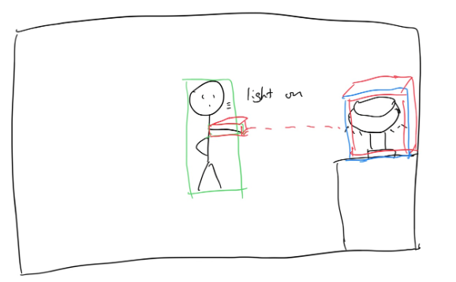

# Arm-Command
## Project Members: Shiwei Hu, Lucas Katayama
### ECEM202A - Embedded Systems, Fall 2023

# Project Introduction

This project aims to allow an user to control smart home devices using their hands by simply pointing to it.

By using a raspberry pi, a camera, and a Lidar, we are able to first detect a person's fingers, create a depth map, and determine which object the user is pointing to. Then, with a simple command (such as saying "on/off") the smart home device will behave as expected. In addition, we plan on adding a laser pointer to provide the user a visual feedback to which object the system determined he/she is pointing to.

# Devices and Frameworks used

## Devices
1. Raspberry Pi
2. Raspberry Pi Camera
3. Intel Realsense L515
4. Servos
5. Laser Pointer
6. TP-Link Kasa Smart Plug

## Frameworks
1. MediaPipe's Hand landmark detection
2. Python-kasa

# Goal
Use gestures only to control home devices without the need of wearable devices or voice control

# Milestones
1. Be able to detect user hand's landmarks
2. Locate smart home devices using camera
3. Create depth map using Lidar
4. Combine Lidar and camera work to determine position where user is pointing to
5. Point laser at chosen device
6. Interface with smart device to toggle on/off

